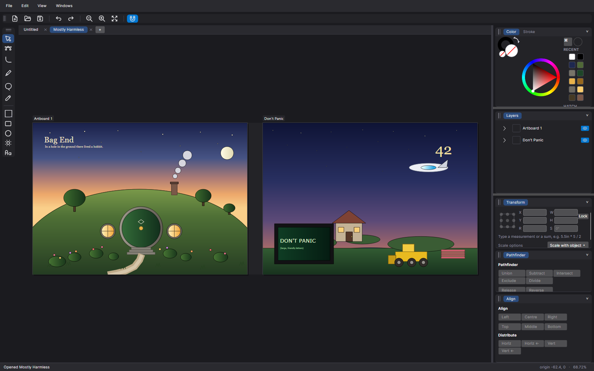
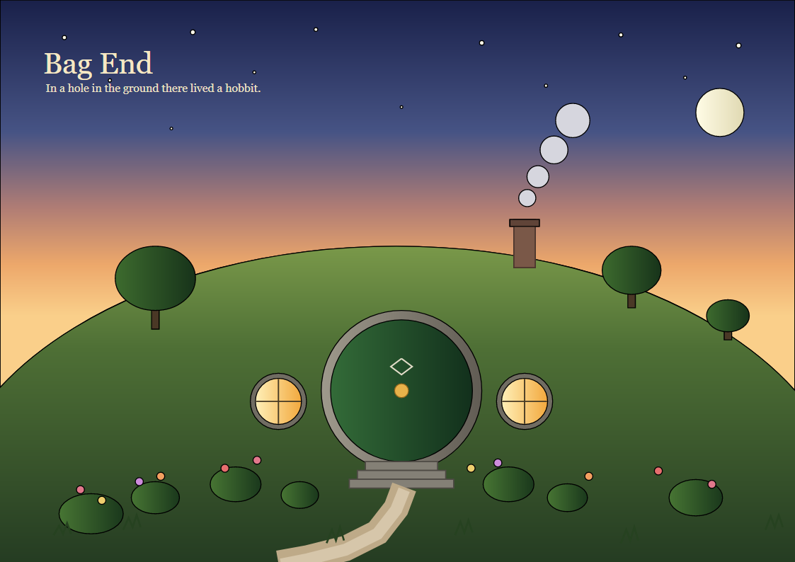
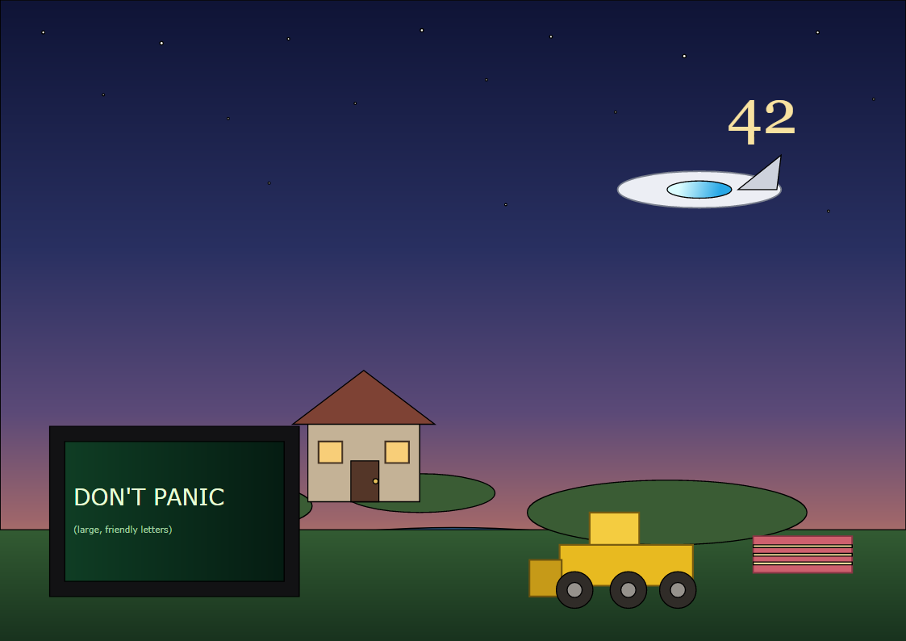
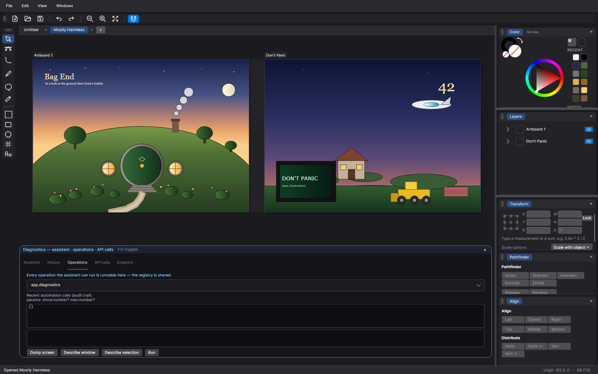

# VCCad

**An Illustrator-style vector editor that is headless-first, API-first, and PDF-lossless.**
C# / .NET 10, Avalonia UI, running as a native desktop app and in the browser via WebAssembly.



Every action in the editor — including opening menus, clicking toolbar buttons and editing panes — goes through
**one** operation registry, and that registry is served over HTTP. So the same actions are available to a person
and to a program. The artwork below was drawn entirely through that API, with no mouse.

| Bag End — A4, 84 objects | Don't Panic — A4, 50 objects |
| --- | --- |
|  |  |

Both are in **one document**, as two A4 artboards.
[The recording of the session that made them](docs/media/making-two-artboards.mp4) — four minutes, every stroke
of it drawn through the API — shows the work as it happened, including the parts that went wrong and were fixed.

---

## What it is

- **A real vector editor.** Artboards → layers → groups → paths, with open and closed paths of line segments and
  cubic Béziers. Fills, gradients, strokes with cap/join/miter/dash/alignment, rich text with embedded-font
  fidelity, boolean path operations, and an undo stack that treats one gesture as one step.
- **Lossless PDF.** Export is **PDF/A-2b** (validated by veraPDF) and carries the whole document model as a
  sidecar stream, so a round trip is exact rather than approximate. Real-world PDFs import faithfully: pages are
  laid out as a grid, clipping is honoured, and a pattern tiled across eight A4 sheets arrives as eight readable
  pages.
- **Illustrator private data, preserved.** `.ai` files keep their private data stream — the styling, layer and
  text structures a PDF content stream flattens away. VCCad decodes it, holds it losslessly and re-emits it on
  export, so nothing is lost even where our own model does not yet cover a feature.
  See [`docs/ai-private-data.md`](docs/ai-private-data.md).
- **Fully automatable.** A loopback HTTP endpoint exposes every operation, and an in-app assistant drives the
  same registry. Point-and-click automation exists for testing gestures, but an API call is preferred: it is
  typed, logged and replayable.
- **Legible without vision.** `ui.dump` serialises the entire visual tree *and* the document tree to text;
  `ui.describe` asks a vision model to describe the window, a layer, the selection or a region.
- **A diary you can learn from.** Every pointer, hover, drag, keystroke, operation and model request is
  timestamped and stored as searchable JSON. Finished work can be distilled into a **skill** the assistant
  recalls on later, similar requests — so a task only has to be worked out once.

## The person and the assistant have the same powers — both ways

This is the rule the application is built around. There is exactly one operation registry, and whether an action
comes from the canvas, the HTTP endpoint or the assistant, it is the same code doing the same thing.



The diagnostics overlay (F12) is the person's half: pick any operation, fill in its parameters, run it, read the
result. Its other tabs show the live diary, every API call with parameters and timings, and the endpoint
settings.

From a terminal, the same registry:

```bash
curl http://127.0.0.1:5099/api/v1/health
curl http://127.0.0.1:5099/api/v1/operations.txt                 # the catalogue, in text, for a model

# draw something
curl -X POST http://127.0.0.1:5099/api/v1/invoke \
     -H 'Content-Type: application/json' \
     -d '{"op":"object.create","params":{"type":"ellipse","cx":420,"cy":300,"rx":60,"ry":60,"fillColor":[0,128,0]}}'

# drive the chrome exactly as a person would
curl -X POST http://127.0.0.1:5099/api/v1/invoke \
     -H 'Content-Type: application/json' \
     -d '{"op":"ui.click","params":{"type":"MenuItem","text":"_File"}}'

# see the screen without pixels
curl -X POST http://127.0.0.1:5099/api/v1/invoke \
     -H 'Content-Type: application/json' -d '{"op":"ui.dump","params":{"scope":"all"}}'
```

## Build, test, run

Requires the **.NET 10 SDK** (pinned by `global.json`) and, for the browser host, the **`wasm-tools`** workload.

```powershell
./scripts/test-all.ps1                        # build + all five suites, corpora auto-detected
dotnet run --project src/VCCad.App.Desktop    # open the editor

./scripts/publish-desktop.ps1                 # self-contained win-x64 bundle
./scripts/publish-desktop.ps1 -Rids win-x64,linux-x64 -Tag 0.2.0
```

```bash
dotnet build VCCad.sln -c Release             # Linux/WSL, includes the WebAssembly host
dotnet test  VCCad.sln -c Release
./scripts/deploy-remote.sh 0.1.0              # build the image on the Docker host, restart the container
```

Five test suites, all green:

| Suite | Covers |
| --- | --- |
| `tests/VCCad.Geometry.Tests` | the pure math kernel |
| `tests/VCCad.Core.Tests` | document model, commands, serializer |
| `tests/VCCad.Pdf.Tests` | PDF writer and reader, import fidelity, PDF/A, corpus sweeps |
| `tests/VCCad.Api.Integration.Tests` | REST and JSON-RPC over WebSocket |
| `tests/VCCad.App.Tests` | Avalonia headless: the shell, panes, gestures, automation |

Corpus-backed suites run over the veraPDF, Ghostscript/MuPDF, pdf.js and `.ai` corpora when they are present, and
emit a skip sentinel when they are not — so a missing corpus is never a silent pass.

## Repository layout

| Path | What it is |
| --- | --- |
| `src/VCCad.Geometry` | Pure math: points, vectors, rects, affine transforms, cubic-Bézier algebra |
| `src/VCCad.Core` | Document model, styling, undo/redo, the lossless JSON serializer |
| `src/VCCad.Pdf` | PDF 1.7 writer **and** reader, vector importer, font embedding, PDF/A-2b, the sidecar |
| `src/VCCad.Api` | Automation host: REST + JSON-RPC, serves the published WebAssembly editor |
| `src/VCCad.App` | The Avalonia shell, and the operation registry everything goes through |
| `src/VCCad.App.Browser` | WebAssembly host (`net10.0-browser`) |
| `src/VCCad.App.Desktop` | Native host for Windows and Linux |
| `tests/` | The five suites above |
| `tools/ai-private-data` | An independent reference decoder and golden manifest for `.ai` private data |
| `docs/` | Format and design notes |
| `scripts/` | dev, test, publish, deploy, corpus fetch |

`Geometry ← Core ← { Pdf, Api, App }`: Geometry never depends on Avalonia or ASP.NET, which is what keeps the
model testable headless.

## Where it is going

Work is tracked as GitHub issues. The current push is **stroke styling** and **SVG**, both aimed at matching
Illustrator and Inkscape:

- **Stroke subsystem (#97–#115)** — an audit of the constant-width model first (done: it found and fixed a dash
  pattern leaking between paths on export), then width profiles, five brush engines, an appearance stack of
  multiple strokes per path, stroke effects, tablet dynamics, one shared rendering pipeline, and the panels to
  edit all of it.
- **SVG import and export (#110, #116–…)** — a real SVG reader and writer, tested against
  [Inkscape's own rendering tests](https://gitlab.com/inkscape/inkscape/-/tree/master/testfiles/rendering_tests),
  with Inkscape used as a reference renderer and its `expected_rendering/` PNGs as gold images.

Everything is filed before it is built, each change is committed with the issue it closes, and a fix is only
claimed once a test fails without it.

## Documentation

- [`AGENTS.md`](AGENTS.md) — the operating manual: environment, commands, conventions, and the gotchas that cost
  real time.
- [`projectplan.md`](projectplan.md) — vision, architecture, milestones and ADRs.

## Licence

MIT for this project. The URW base-35 fonts are **located on the machine and never redistributed**; their font
exception permits embedding them in an exported PDF, which is what export does. Illustrator `.ai` private data
is preserved in documents that carry it, on the same terms as any other embedded content.
